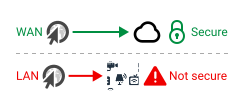

# Local Peer-to-Peer API Explained

The Local Peer-to-Peer API enables browsers to connect securely over a [local communication medium](https://wicg.github.io/local-peer-to-peer/#local-communication-medium), without the aid of a server in the middle.

The API provides a powerful new building block for developers while ensuring a seamless, secure and privacy preserving experience for the user. By putting the user-agent in control during discovery and authentication, bare minimal [communication medium topology](https://wicg.github.io/local-peer-to-peer/#communication-medium-topology) information is exposed to an origin.

Please refer to the [specification](https://WICG.github.io/local-peer-to-peer/) for the the formal draft spec.

### Motivation

The local network is not a first-class citizen of the web. It’s easier for a browser to trust a faraway server than your NAS, TV or thermostat sitting right next to you.



As a blast from the past:

> Tim Berners-Lee's [vision for the World Wide Web](https://www.w3.org/People/Berners-Lee/1996/ppf.html) was close to a P2P network [...] The early Internet was more open than the present day, where _two machines connected to the Internet could send packets to each other_ without firewalls and other security measures. ([Wikipedia](https://en.wikipedia.org/wiki/Peer-to-peer#Historical_development))

This proposal sets to make a part of this Tim's vision a reality while adhering to the modern security and privacy requirements expected of modern web capabilities.

### Goals

Build a generic Local Peer-to-Peer API and provide an arbitrary bidirectional communication channel to the web for devices in the context of a [local communication medium](https://wicg.github.io/local-peer-to-peer/#local-communication-medium), including:

- Methods to discover, request, and connect to peers on the local communication medium
- Listeners to notify if these method calls succeed or fail
- Listeners to notify if the connection is received or its status is updated
- Means to send and receive data after connection to a peer device has been established
- Means to enable secure HTTPS connections on the local communication medium

As a commitment to an open standards-based implementation path, this specification describes how the API can be implemented on top of the [Open Screen Protocol](https://w3c.github.io/openscreenprotocol/). While not described here, the API is expected to be implementable on top of other transports when technically feasible.

### Non-goals

- Providing direct access to TCP/UDP sockets.
- Compromising Cross-Origin Resource Sharing (CORS) in any way.

## Use Cases

### UC1: Offline collaboration

- Collaboration tools that work during an internet outage or emergency situations
- Ephemeral groups support: Share files to a group with a single “push” vs. sending to each friend one at a time


Figure 1: Collaborate using local communication in Google Doc

### UC2: Disaster relief

- The ability to for Web-based tools to work on ad-hoc networks in the absence of internet infrastructure.
- An app that allows humanitarian field workers in remote areas with no connectivity to gather, synchronize, review, and edit data offline for several days, the data can then be synchronized with the central server when internet connection becomes available
- A non-profit educational organization is concerned about the large file download size required for on-device speech recognition in the browser. This is problematic in low bandwidth, high latency environments such as classrooms, particularly in emerging countries. Their goal is for one student to download the file first and then easily share/distribute it with classmates without low speed internet connections any more to save time and cost

### UC3: Cross-device workflows

- Send and receive files instantly, including photos or videos, between mobile phone, tablet, and personal computer without using mobile data or internet connection
- Add the "Import file nearby" and “Export to nearby” buttons in web version of Figma on desktop to access images from mobile devices"
- Open files in "Nearby" tab in "Open a file" dialog of Google doc
- Video editing web app that allows users to ingest footage directly from their phone.
- Seamlessly sync private keys and other identity credentials across personal devices, securely transfer one-time pads to encrypt and decrypt messages


Figure 2: Web Drop, an In-App Sharing feature based on Local Peer-to-Peer API compare with cloud-client solution

### UC4: Home Services & IoT

- Seamlessly connecting to your NAS or your home security system. Avoiding the need for workarounds including self-signed certificates or a cloud proxy services.
- Allow web apps to connect to your robot mower, vacuum or robotic assistant folding the laundry.
- Avoiding the need for companion native apps for services running in the home environment, e.g.: Home Assistant, Plex, BitWarden, NextCloud, ...

### UC5: Local multi-player

- In-App Sharing, quickly share group photos or videos with friends without relying on cloud services
- Run a game in web app on the smart TV, use mobile phone as the game controller via this local peer-to-peer API to send control messages

- Run a 2 players web game on two mobile phones, synching messages between two players instantly


Figure 3: Play web game cross smart TV and mobile phone

### Requirements

The following are the high-level requirements derived from the use cases:

- R1: Discover device(s) on the local communication medium
- R2: Advertise yourself to device(s) on the local communication medium
- R3: Establish a bi-directional communication channel between two devices on the local communication medium
- R4: Allow secure connection to web pages hosted on the local communication medium.
- R5: User consent and delegation per web origin.

### Prerequisites

What is a prerequisite for all these use cases is that the participating devices can be connected via a [local communication medium](https://wicg.github.io/local-peer-to-peer/#local-communication-medium) because they are physically nearby to each other and as such able to establish a direct connection using either a wireless connectivity technology such as Wi-Fi Direct, Wi-Fi via access point, or a wired computer networking technology such as Ethernet. This connection technology and its details are abstracted out by both the Web API exposed to web developers as well as the UI/UX visible to the user.

In summary, the following are the prerequisites:

- The participating devices share a local communication medium.

### References

- https://github.com/WICG/proposals/issues/103
- https://github.com/WICG/private-network-access/issues/23
- https://github.com/WICG/local-peer-to-peer/issues/19
- https://github.com/ipfs/local-offline-collab
- https://offlinefirst.org/
- https://github.com/pion/offline-browser-communication

## Solution Approach

The Local Peer-to-Peer API uses the to mutual authentication provided by the Open Screen Protocol to establish mutual TLS certificates between peers. These certificates serve as a trust anchor for secure [local communication](https://wicg.github.io/local-peer-to-peer/#local-communication). The Local Peer-to-Peer specification defines two uses of this new trust anchor:

1. Enabling HTTPS on the local communication medium.
2. Enabling secure local communication using the `DataChannel` and `WebTransport` APIs.

### API Design

Peer-to-Peer communication starts with service discovery. For this purpose, the LP2PReceiver API allows an origin to advertise itself. The LP2PRequest API allows discovery of a peer on the local communication medium. The design if these APIs is inspired by the work of the Presentation API's PresentationRequest & PresentationReceiver. Data exchange itself is provided by two APIs: `LP2PDataChannel` & `LP2PQuicTransport`. The [LP2PDataChannel API](https://wicg.github.io/local-peer-to-peer/#lp2p-data-channel) is inspired by the RTCDataChannel API. This API caters to simple message passing use-cases and developer familiar with WebRTC. The API design augments that of the WebRTC RTCDataChannel API. The [LP2PQuicTransport API](<](https://wicg.github.io/local-peer-to-peer/#lp2p-quic-transport)>) design is inspired by the WebTransport API. This API is designed for use-cases where more direct control over the underlying transport is preferred.

## Shorthand APIs

The specification provides shorthand APIs for the most common use cases. More granular APIs are discussed below.

```js
// Peer A
const listener = lp2p.makeDiscoverable(options);

for await (const transport of listener.incomingTransports) {
  await transport.ready;
}
```

```js
// Peer B
const transport = lp2p.connect(options);

await transport.ready;
```

_Note_: the shorthand APIs are a work in progress. They are illustrative and will change, see [#35](https://github.com/WICG/local-peer-to-peer/issues/35).

## Local HTTPS

The Local Peer-to-Peer API's authentication process establishes mutual TLS certificates between peers on a [local communication medium](https://wicg.github.io/local-peer-to-peer/#local-communication-medium). These certificates can serve as a trust anchor to validate certificates used by HTTPS servers on the local communication medium.

Please refer to [Local HTTPS](https://wicg.github.io/local-peer-to-peer/#local-https) in the specification for more details.

_Note_: Local HTTPS is a work in progress, see [#34](https://github.com/WICG/local-peer-to-peer/issues/34).

## Peer discovery

Before any connection can be established, two peers on the local communication medium must find each other. This is done using the `LP2PReceiver` and `LP2PRequest` interfaces:

```js
// Peer A
const receiver = new LP2PReceiver({
  nickname: "Peer A",
});

receiver.onconnection = (e) => {
  const conn = e.connection;
  console.log("Receiver: Got a connection!");
};
```

Please refer to the [LP2PReceiver Interface](https://wicg.github.io/local-peer-to-peer/#lp2p-receiver) in the specification for more details.

```js
// Peer B
const request = new LP2PRequest({
  nickname: "Peer B",
});

const conn = await request.start();
console.log("Requester: Got a connection!");
```

Please refer to the [LP2PRequest Interface](https://wicg.github.io/local-peer-to-peer/#lp2p-request) in the specification for more details.

_Note_: The exact attributes used for peer discovery and filtering are still being discussed, see [#15](https://github.com/WICG/local-peer-to-peer/issues/15)

## Simple message exchange

Once two peers have found each other, they can establish a connection. The `LP2PDataChannel` interfaces allow sending and receiving messages over the connection:

```js
// Peer A
conn.ondatachannel = (e) => {
  const channel = e.channel;

  channel.send("Good day to you, requester!");
};
```

```js
// Peer B
const channel = conn.createDataChannel("My Channel");

channel.onmessage = (e) => {
  console.log(`Receiver: Received message: ${e.data}`);
};
```

Please refer to the [LP2PDataChannel Interface](https://wicg.github.io/local-peer-to-peer/#lp2p-data-channel) in the specification for more details.

## Advanced data exchange

The `LP2PQuicTransportListener` and `LP2PQuicTransport` interfaces allow opening a [WebTransport](https://www.w3.org/TR/webtransport) connection between two peers.

```js
// Peer A
const listener = new LP2PQuicTransportListener(receiver);

for await (const transport of listener.incomingTransports) {
  await transport.ready;
}
```

```js
// Peer B
const transport = new LP2PQuicTransport(request);

await transport.ready;
```

Please refer to the [LP2PQuicTransport Interface](https://wicg.github.io/local-peer-to-peer/#lp2p-quic-transport) in the specification for more details.

## User Interaction Considerations

ℹ️ This section is informative.

This section represents concepts of how a user could discover, connect and share files from one device to the other device nearby.


Figure 4: User flow to discover and share files

## Security and Privacy

The Local Peer-to-Peer API has been designed specifically with security and privacy in mind. Please refer to the [Security and Privacy Self-Review](./security-privacy-questionnaire.md) for more details.

## Considered Alternatives

When a user wants to connect between two devices on the same local communication medium, for example to another device nearby—be it another device the user owns or that of a friend—the user has multiple ways to accomplish this task:

1. _A cloud service_. The web has many ways of connections to a third-party cloud service: HTTP, WebSocket or WebTransport. However, all of these methods require a round trip through the internet. This is inherently dependant on external resources, it consumes network bandwidth and can be slow or costly and has privacy implications in all but the strongest E2E encryption schemes.

2. _A local server_. Many modern Web security measures rely on the presence of naming, signaling and certificate authorities. Local use-cases where these authorities are not readily available have started lagging behind in user experience or are not supported altogether. A local solution involves knowing IPs, ports and accepting/ignoring a plethora of "Not secure" warnings to get going. This falls short of the user-friendliness that one can expect of—nowadays ubiquitous—cloud services.

3. _A WebRTC connection_. While WebRTC is a P2P protocol, it still requires a setup step usually referred to as 'signaling'. There is no good way to perform this step without relying on an existing connection between peers, commonly a cloud service is used.

None of these solutions to this seemingly common task provide a compelling user experience. When the devices share a local communication medium the user's expectation is the connection process should be as seamless as any physical interaction. With a variety of [local communication](https://wicg.github.io/local-peer-to-peer/#local-communication) technologies widely supported on today's devices we believe this user experience can be vastly improved.

This illustrates the gap for an optimized path for [local communication](https://wicg.github.io/local-peer-to-peer/#local-communication) by web applications.


Figure 5: Proposed Web Local Peer-to-Peer along with other existing options

4. The _Web Share and Web Share Target_ provide a minimal API to share text and files to a user-selected share target, including to another website, utilizing the sharing mechanism of the underlying operating system.

While the Web Share API partially satisfies the requirement R2 set forth above, the Web Share API by its design defines a minimal API surface that is likely not amenable to extensions required to support additional use cases and requirements outlined in this explainer. Notably, the Web Share API is a "push-based" API where content is pushed from one device to another device while the Local Peer-to-Peer API is catering to both the "push-based" as well as "pull-based" use cases as illustrated by "drop files here and share" and "import file nearby" concepts respectively. From the UX perspective, the Local Peer-to-Peer API allows for a more seamless in-web app experience in use cases where a system-provided share facility would disrupt the user flow.

Certain use cases can benefit from an internet-based P2P fallback if local communications is not available. To minimize conceptual weight for web developers, this API attempts to align with the established conventions and API semantics of other communication APIs such as WebTransport API, WebRTC, Fetch, and Presentation API, where applicable.

### Previous work

A number of efforts exist in this area including the [TCP and UDP Socket API](https://www.w3.org/TR/tcp-udp-sockets/), [Discovery API](https://www.w3.org/TR/discovery-api/) and [FlyWeb](https://flyweb.github.io/).

The Local Peer-to-Peer approach differs from previous work by putting the user-agent in control during device discovery and mutual authentication. This approach allows exposing bare minimal information about the device to an origin. The list of discovered devices is never shared with the origin and individual peer descriptors such as nickname are only shared with the origin after authentication and user consent. No [communication medium topology](https://wicg.github.io/local-peer-to-peer/#communication-medium-topology) information such as IP addresses is ever shared with an origin.

The following works are seen as precedent and guide the design of the Local Peer-to-Peer API: [Open Screen Protocol](https://www.w3.org/TR/openscreenprotocol/), [Presentation API](https://www.w3.org/TR/presentation-api/), [Remote Playback API](https://www.w3.org/TR/remote-playback/) [WebRTC](https://www.w3.org/TR/webrtc/), [ORTC (draft)](https://draft.ortc.org/), [WebTransport](https://www.w3.org/TR/webtransport/), [P2P WebTransport (draft)](https://w3c.github.io/p2p-webtransport/).

## References & Acknowledgements

Many thanks for valuable feedback and advice from:

- [Reilly Grant](https://github.com/reillyeon)
- [Sathish K Kuttan](https://github.com/sathishkuttan)
- Chia-hung S Kuo
- [Kyle Simpson](https://github.com/getify)
- [Drake42](https://github.com/Drake42)
- [Espen Klem](https://github.com/eklem)
- [Alex Bertram](https://github.com/akbertram)
- [Michiel De Backker](https://github.com/backkem)
