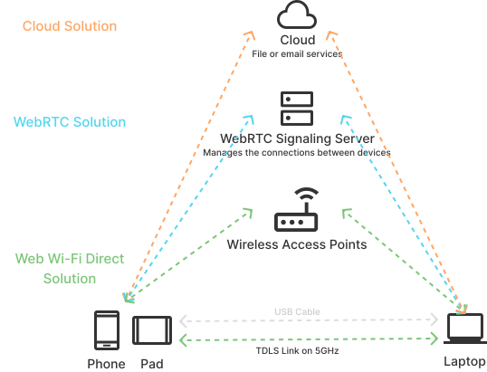
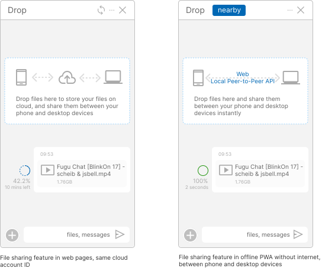
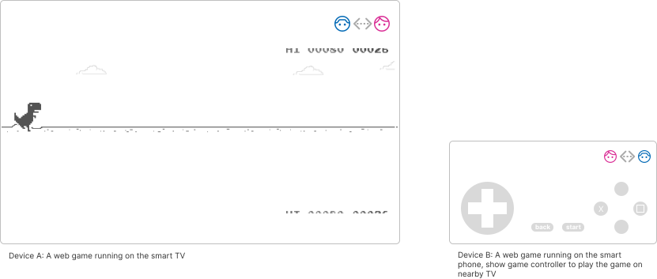
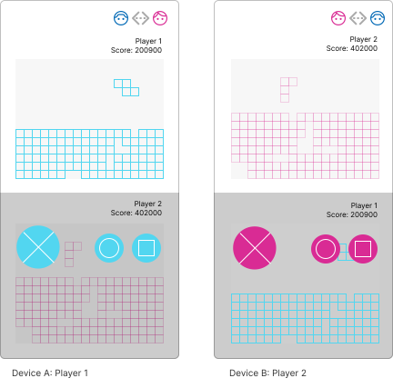
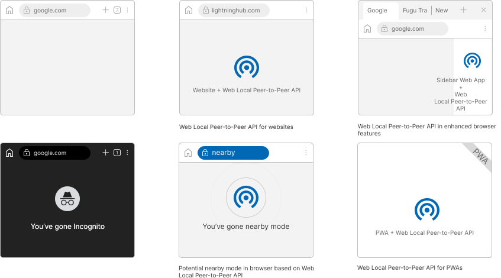
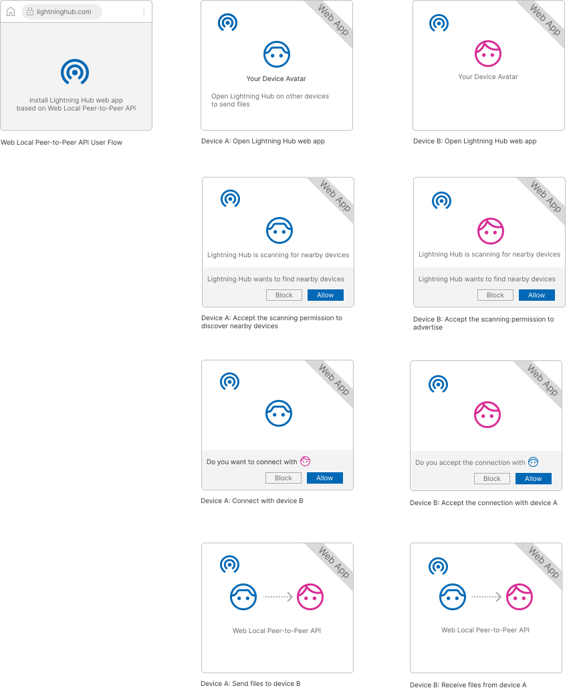

https://github.com/w3c/web-share/blob/main/docs/explainer.md

# Local Peer-to-Peer API Explained

## Introduction

The Local Peer-to-Peer API enables supported mobile and desktop devices to transfer messages or files through close-range wireless communication on the web.

- [Wi-Fi Direct](https://www.wi-fi.org/discover-wi-fi/wi-fi-direct) (aka. Wi-Fi P2P)
- [Wi-Fi Certified TDLS](https://www.wi-fi.org/news-events/newsroom/wi-fi-alliance-now-certifying-tunneled-direct-link-setup)
- [Apple Wireless Direct Link (AWDL)](https://owlink.org/wiki/#what-is-apple-wireless-direct-link-awdl)

The maturity of those Project Fugu APIs, specially Web Bluetooth, Web NFC, File System Access API (M86) and File Handling API (M102), together with their implementation in browser has had a positive impact on the feasibility of the Local Peer-to-Peer API. We are confident that Web Local Peer-to-Peer API will be an easy to use API that web developers will be comfortable with.

## Problem Description

When transfer files to other devices or share files to friends or colleagues on the web in the same Wi-Fi environment, usually we have two following approaches with their limiations.

1. The centralized service, member fee, long round trip through internet, data wastage, and privacy concern are the drawbacks to share files by using cloud storage service.

2. Send the file directly through the WebRTC peer to peer on the web requires internet connection to communicate with WebRTC signaling server which establishes and manages the connections between devices.

We need an optimized network path to use a local network connected by the devices for web applications.



Figure 1: Proposed Web Local Peer-to-Peer along with other existed options

## Use-Cases

In a Wi-Fi P2P environment, use cases such as message synchronization, file transfer, multiple users file sharing, device screen projection, multi-screen collaboration and connection with smart home devices can benefit from web apps through the support of Local Peer-to-Peer API.

Single-user:

- Send and receive files instantly, including photos or videos, between mobile phone, tablet, and PC without using mobile data or internet connection
- Add the "Import file nearby" and “Export to nearby” buttons in web version of Figma on desktop to access images from mobile devices"
- Open files in "Nearby" tab in "Open a file" dialog of Google doc
- Run a game in web app on the smart TV, use mobile phone as the game controller via this local peer-to-peer API to send control messages



Figure 2: Web Drop, an In-App Sharing featue based on Local Peer-to-Peer API compare with cloud-client solution


Figure 3: (Potential) Import file from nearby devices in web based Figma app


Figure 4: (Potential) Open a file from nearby devices in Google Doc



Figure 5: (Potential) Play web game cross smart TV and mobile phone

Multi-user:

- In-App Sharing, quickly share group photos or videos with friends without relying on cloud services
- Share web packaging / web bundles offline while on an airplane, with Wi-Fi connection only
- Run 2 players web game on two mobile phones, sync messages for two players instantly



Figure 6: (Potential) Play a web game across two nearby devices with 2 players

## Possible Shapes



## User Flow

Here's how a user to discover, connect and share files from one device to the other device.



## Goals

Build a generic local peer-to-peer API and provide an arbitrary bidirectional channel on the web for devices under short-range wireless communication environment.

The API will abstract over peer-to-peer technology (including [Wi-Fi Direct](https://www.wi-fi.org/discover-wi-fi/wi-fi-direct), [AWDL](https://owlink.org/wiki/#what-is-apple-wireless-direct-link-awdl)) and provide a high-level interface for two instances of a web app running on peer devices to discover and connect to each other.

The Local Peer-to-Peer API will cover following main parts:

- Methods to discover, request, and connect to peers.
- Listeners to notify of these method calls success or failure, connection status update or new discovered peer.
- Send and receive data after connecting to a peer device which may open TCP or UDP socket.

## Non-goals

## Proposed API

[For each related element of the proposed solution - be it an additional JS method, a new object, a new element, a new concept etc., create a section which briefly describes it.]

```js
// Provide example code - not IDL - demonstrating the design of the feature.

// If this API can be used on its own to address a user need,
// link it back to one of the scenarios in the goals section.

// If you need to show how to get the feature set up
// (initialized, or using permissions, etc.), include that too.
```

[Where necessary, provide links to longer explanations of the relevant pre-existing concepts and API.
If there is no suitable external documentation, you might like to provide supplementary information as an appendix in this document, and provide an internal link where appropriate.]

[If this is already specced, link to the relevant section of the spec.]

[If spec work is in progress, link to the PR or draft of the spec.]

[etc.]

## Key scenarios

[If there are a suite of interacting APIs, show how they work together to solve the key scenarios described.]

### Scenario 1

[Description of the end-user scenario]

```js
// Sample code demonstrating how to use these APIs to address that scenario.
```

### Scenario 2

[etc.]

## Detailed design discussion

### [Tricky design choice #1]

[Talk through the tradeoffs in coming to the specific design point you want to make.]

```js
// Illustrated with example code.
```

[This may be an open question,
in which case you should link to any active discussion threads.]

### [Tricky design choice 2]

[etc.]

## Considered Alternatives

### [Alternative 1]

Part of requirements can be met through the Web Share and Web Share Target APIs, as platforms which already provide a peer-to-peer file sharing option. The generic Local Peer-to-Peer API could generate unlimited possibilities for web applications to work with their specific features together seamlessly, the Web Share and Web Share Target cannot provide the consistent experience e.g. In-Web Share or In-Web Message Sync.

## Stakeholder Feedback / Opposition

[Implementors and other stakeholders may already have publicly stated positions on this work. If you can, list them here with links to evidence as appropriate.]

- [Implementor A] : Positive
- [Stakeholder B] : No signals
- [Implementor C] : Negative

[If appropriate, explain the reasons given by other implementors for their concerns.]

## References & Acknowledgements

Many thanks for valuable feedback and advice from:

- [Reilly Grant](https://github.com/reillyeon)
