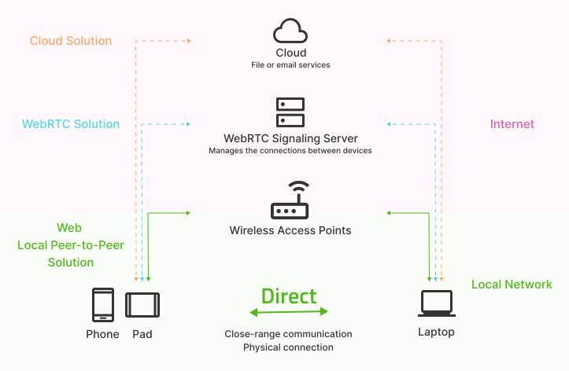

# Local Peer-to-Peer API Explained

## Introduction

The Local Peer-to-Peer API enables mobile and desktop devices to transfer messages or files through close-range communication in a privacy-preserving manner.

This proposed high-level Web API aspires to provide a web-friendly abstraction that hides the complexity of various underlying peer-to-peer technologies from both users and web developers. 

Examples of such low-level technologies and protocols abstracted out by this proposal include:

- [Wi-Fi Direct](https://www.wi-fi.org/discover-wi-fi/wi-fi-direct) (aka. Wi-Fi P2P)
- [Apple Wireless Direct Link (AWDL)](https://owlink.org/wiki/#what-is-apple-wireless-direct-link-awdl)

These example technologies and protocols are considered implementation details and this proposal plans to reuse and build upon applicable W3C specifications such as the [Open Screen Protocol](https://www.w3.org/TR/openscreenprotocol/) to recommend an open standards-based implementation path across platforms and browsers for its intended use cases. Notably, this proposal does not define any hardware features or algorithms.

Existing emergent Web APIs such as Web Bluetooth and Web NFC have enabled short-range local communication between devices. File System Access API and File Handling API have provided access to the user's local files. These two classes of Web APIs have been validated with real-world use cases and adopted by forward-looking web developers.

The proposed Local Peer-to-Peer API fills a remaining web feature gap by marrying secure local communication with file access wrapped into a privacy-preserving user experience that maps to a user's mental model. The proposed Local Peer-to-Peer API aims to allow for easy integration into existing web applications by couple of lines of code.

As a blast from the past:

>Tim Berners-Lee's [vision for the World Wide Web](https://www.w3.org/People/Berners-Lee/1996/ppf.html) was close to a P2P network [...] The early Internet was more open than the present day, where _two machines connected to the Internet could send packets to each other_ without firewalls and other security measures. ([Wikipedia](https://en.wikipedia.org/wiki/Peer-to-peer#Historical_development))

This proposal sets to make a part of this Tim's vision a reality while adhering to the modern security and privacy requirements expected of modern web capabilities.

## Problem Description

When a user wants to transfer a file from a web site to another device nearby—be it another device the user owns or that of a friend—the user has multiple ways to accomplish this task:

1. A centralized cloud service. The file is transferred to a third-party cloud service. This requires a round trip through the internet that consumes network bandwidth and can be slow, costly, or both. The file must be stored on a third-party server, which may not be what the user wants for files that can contain privacy-sensitive information.

2. A custom WebRTC-based solution. The file is sent between browsers with WebRTC data channels. This solution requires an internet connection for communication with a WebRTC signalling server that is required to establish and manage the connections between the devices.

3. Email. A file can be sent as an email attachment using a cloud-based service. Arbitrary email attachment size limitations cause frustration and the common Base64 encoding for attachments adds about 37% to the original file size. Arguably an email-as-a-file-sharing-service has a suboptimal user experience.

None of these solutions to this seemingly common task provide a compelling user experience. When the devices are physically nearby the user's expectation is the file transfer would be as quick and seamless as handing out physical objects to another person close by. With close-range communication technologies widely supported on today's devices we believe this user experience can be vastly improved.

We need an optimized network path to use a local network connected by the devices for web applications.



Figure 1: Proposed Web Local Peer-to-Peer along with other existing options

## Use Cases

### UC1: Single User Multiple Devices

- Transfer JSON and other data formats from one device to another
- An app that allows users to copy text on one device and paste that same text on another device
- Send and receive files instantly, including photos or videos, between mobile phone, tablet, and personal computer without using mobile data or internet connection
- Add the "Import file nearby" and “Export to nearby” buttons in web version of Figma on desktop to access images from mobile devices"
- Open files in "Nearby" tab in "Open a file" dialog of Google doc
- Run a game in web app on the smart TV, use mobile phone as the game controller via this local peer-to-peer API to send control messages
- Video editing web app users to pull a clip from their phone by giving explicit permission for single clip (or a directory) on the phone, select content (or browse) stored on the phone from the desktop browser
- Seamlessly sync private keys and other identity credentials across personal devices, securely transfer one-time pads to encrypt and decrypt messages


Figure 2: Web Drop, an In-App Sharing feature based on Local Peer-to-Peer API compare with cloud-client solution


Figure 3: Import file from nearby devices in web based Figma app


Figure 4: Open a file from nearby devices in Google Doc


Figure 5: Play web game cross smart TV and mobile phone

### UC2: Multiple Users and Devices

- In-App Sharing, quickly share group photos or videos with friends without relying on cloud services
- Run a 2 players web game on two mobile phones, synching messages between two players instantly
- Ephemeral groups support: Share files to a group with a single “push” vs. sending to each friend one at a time
- An app that allows humanitarian field workers in remote areas with no connectivity to gather, synchronize, review, and edit data offline for several days, the data can then be synchronized with the central server when internet connection becomes available


Figure 6: Play a web game across two nearby devices with 2 players

### Requirements

The following are the high-level requirements derived from the use cases:

- R1: Discover nearby device(s)
- R2: Push file(s) from one device to nearby device(s)
- R3: Pull file(s) from a nearby device(s)
- R4: Establish a bi-directional communication channel between two nearby devices

### Prerequisites

What is a prerequisite for all these use cases is that the participating devices are physically nearby to each other and as such able to establish a direct connection using either a wireless connectivity technology such as Wi-Fi Direct, Wi-Fi via access point, or a wired computer networking technology such as Ethernet. This connection technology and its details are abstracted out by both the Web API exposed to web developers as well as the UI/UX visible to the user.

In summary, the following are the prerequisites:

- The participating devices are physically nearby (the definition of "nearby" is an implementation detail)
- The participating devices are able to establish a direct connection using some connection technology (the supported technologies may vary depending on hardware and OS capabilities and remain an implementation detail)

## User Interface Considerations

ℹ️ This section is informative.

This section presents examples of user interface concepts. Implementers are expected to come up with their own shapes and forms for the user interface elements that fit the conventions of the underlying platform, form factor and the browser.


## User Interaction Considerations

ℹ️ This section is informative.

This section represents concepts of how a user could discover, connect and share files from one device to the other device nearby.


## Goals

Build a generic local peer-to-peer API and provide an arbitrary bidirectional channel on the web for devices under short-range communication environment.

The API will abstract over peer-to-peer technology and provide a high-level interface for two instances of a web app running on peer devices to discover and connect to each other.

The Local Peer-to-Peer API will cover the following main parts:

- Methods to discover, request, and connect to peers
- Listeners to notify if these method calls succeed or fail
- Listeners to notify if the connection status is updated or a new peer is discovered
- Means to send and receive data (e.g., over a TCP or UDP socket) after connection to a peer device has been established

## Non-goals

A non-goal is to enable web apps to communicate with the native system apps over peer-to-peer technology.

## Proposed API

>ℹ️ **Note:** In this example we walk through a use case where two peers A and B send one message to each other. The example covers making a peer discoverable, finding other peers, establishing a connection between the two peers, setting up listeners for messages and disconnection, and sending of messages. The payload in this example is a string, but it could also be a Blob or an ArrayBuffer. The example code is provided for illustrative purposes only and is expected to have rough edges. The API shape, both naming and design, is expected to change based on feedback and early implementation insights. Peer A and peer B operate on parallel timelines even if the example code is presented here sequentially.

🅰️ **Peer A** makes itself discoverable with a nickname `device A`. The promise resolves only if a user's consent is received to make this device discoverable by other peers (see [User Interface Considerations](#user-interface-considerations) and [User Interaction Considerations](#user-interaction-considerations)).

```js
let p2pSession = await navigator.p2p.makeDiscoverable({ nickname: "device A" });
let peerB = null;
```

🅰️ **Peer A** starts to listen to `connect` events that signal when a connection is established with  another peer. Upon connection establishment, peer A chooses to accept the first connection it receives from another peer (we assume to be peer B to keep the example simple), and starts to listen to `message` and `disconnect` events from peer B.

```js
p2pSession.addEventListener("connect", function (event) {
    peerB = event.peer;
    peerB.accept(); // or peerB.reject();
    peerB.addEventListener("message", function (event) { /* ... */ });
    peerB.addEventListener("disconnect", function (event) { /* ... */ });
});
```

 🅰️ **Peer A** sends a message "`Hello from peer A!`" to peer B. If this fails, an error is logged to console and the connection to peer B is disconnected.

```js
try {
    await peerB.send("Hello from peer A!"); // or Blob or ArrayBuffer
} catch (error) {
    console.log("Failed to send the message to peer B!", error);
    peerB.disconnect();
}
```

🅱️ **Peer B** starts to find peers. This requires user's consent similarly to making a peer discoverable (see [User Interface Considerations](#user-interface-considerations) and [User Interaction Considerations](#user-interaction-considerations)).

```js
let p2pSession = await navigator.p2p.findPeers({ /* ... */ });
let peerA = null;
```

🅱️ **Peer B** receives a `peerdiscovery` event when a peer is found and the first peer is assumed to be peer A (for simplicity).

```js
p2pSession.addEventListener("peerdiscovery", function (event) {
    peerA = event.peerList[0];
});
```

🅱️ **Peer B** establishes a connection to peer A. The promise resolves only if the user's consent (see [User Interface Considerations](#user-interface-considerations) and [User Interaction Considerations](#user-interaction-considerations)) has been acquired for connecting with peer A. Peer B starts to listen to `message` and `disconnect` events from peer A.

```js
try {
    await peerA.connect({ /* ... */ });
    peerA.addEventListener("message", function (event) { /* ... */ });
    peerA.addEventListener("disconnect", function (event) { /* ... */ });
} catch (error) {
    console.log("Failed to establish a connection!", error);
}
```

🅱️ **Peer B** sends a message "`Hello from peer B!`" to peer A (this time without error checking).

```js
await peerA.send("Hello from peer B!"); // or Blob or ArrayBuffer
```

## Implementation Considerations

ℹ️ This section is informative.

### Discovery

There has been past attempts to standardize a discovery mechanism in the context of the web. [Network Service Discovery](https://www.w3.org/TR/discovery-api/) was an early attempt superseded by purpose-built Presentation API and the Remote Playback API that in turn build upon the [Open Screen Protocol](https://www.w3.org/TR/openscreenprotocol/) (OSP) that uses DNS Service Discovery (DNS-SD) and Multicast DNS (mDNS) for discovery.

Discovery in this context is agnostic to whether it happens over IP or another radio technology that does not use IP for addressing. For example, Bluetooth LE identifies devices by their Bluetooth Device Address and listens to advertising packets from other devices. (The [Bluetooth LE Primer](https://www.bluetooth.com/wp-content/uploads/2022/05/The-Bluetooth-LE-Primer-V1.1.0.pdf) explains how the Bluetooth LE stack differs from the OSI reference model in this regard.)

DNS-SD protocol is commonly used to discover a named list of service instances in the local network using standard DNS queries while mDNS protocol uses DNS-like operations on the local network to resolve a domain name for a local address. DNS-SD is often used in conjunction with mDNS and may provide one possible implementation for discovery of peers e.g. through a [protocol extension](https://www.w3.org/TR/openscreenprotocol/#protocol-extensions) to the Open Screen Protocol.

If the discovery is blocked by the network (e.g., no broadcast-capable medium exists when on an in-flight Wi-Fi service) the underlying implementation may choose to use other technology such as Bluetooth or NFC for discovery and use an appropriate peer to peer technology to transfer the content once the peer has been discovered.

### Transport

Once the discovery process is completed, the content transfer can use a transport layer protocol of choice such as TCP, UDP, QUIC or other, over any link layer protocol available such as Wi-Fi or Wi-Fi Direct. 

Similar to the discover phase, supporting data exchange over Bluetooth or NFC could be an optional or fallback implementation as alternative transports.

## Security and Privacy

The Local Peer-to-Peer API can minimize security and privacy risks associated with cloud services. Web app users can choose to limit the use to offline mode only (completely disconnect the Internet) which improves the security further and avoids the information leak to cloud.

Initial restrictions must be implemented to balance the risk trade-offs in accordance with security models.

- Web browser restricted access
- [Secure context](https://w3c.github.io/webappsec-secure-contexts/) required
- Least privilege principle, permission granted one device to one site
- Pairing individual device requires at least a user action
- User informed when the device is connected
- Disconnect automatically after a period of inactivity (implementation-defined e.g. 10 minutes) with an extension opportunity with a user's consent
- Authorization on a per-session basis: Colleagues, friends, family members or the user themselves can authorize the “content pull request” on the device that can allow pulls for one session (e.g. 10 minutes)
- We are investigating whether this API should be restricted to PWA only

## Considered Alternatives

The Web Share and Web Share Target provide a minimal API to share text and files to a user-selected share target, including to another website, utilizing the sharing mechanism of the underlying operating system.

While the Web Share API partially satisfies the requirement R2 set forth above, the Web Share API by its design defines a minimal API surface that is likely not amenable to extensions required to support additional use cases and requirements outlined in this explainer. Notably, the Web Share API is a "push-based" API where content is pushed from one device to another device while the Local Peer-to-Peer API is catering to both the "push-based" as well as "pull-based" use cases as illustrated by "drop files here and share" (Figure 2) and "import file nearby" (Figure 3) concepts respectively. From the UX perspective, The Local Peer-to-Peer API allows for a more seamless in-web app experience in use cases where a system-provided share facility would disrupt the user flow.

Certain use cases can benefit from an internet-based P2P fallback if local communications is not available. To minimize conceptual weight for web developers, this API attempts to align with the established conventions and API semantics of other communication APIs such as WebTransport API, WebRTC, Fetch, and Presentation API, where applicable.

## References & Acknowledgements

Many thanks for valuable feedback and advice from:

- [Reilly Grant](https://github.com/reillyeon)
- [Sathish K Kuttan](https://github.com/sathishkuttan)
- Chia-hung S Kuo
- [Kyle Simpson](https://github.com/getify)
- [Drake42](https://github.com/Drake42)
- [Espen Klem](https://github.com/eklem)
- [Alex Bertram](https://github.com/akbertram)
