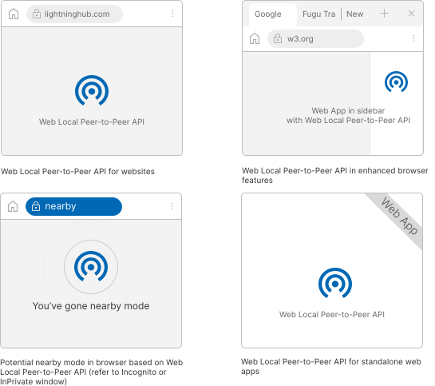

# Local Peer-to-Peer API Explained

## Introduction

The Local Peer-to-Peer API enables mobile and desktop devices to transfer messages or files through close-range wireless communication in a privacy-preserving manner.

This proposed high-level Web API aspires to provide a web-friendly abstraction that hides the complexity of various underlying peer-to-peer technologies from both users and web developers. Examples of such low-level technologies and protocols abstracted out by this proposal include:

- [Wi-Fi Direct](https://www.wi-fi.org/discover-wi-fi/wi-fi-direct) (aka. Wi-Fi P2P)
- [Wi-Fi Certified TDLS](https://www.wi-fi.org/news-events/newsroom/wi-fi-alliance-now-certifying-tunneled-direct-link-setup)
- [Apple Wireless Direct Link (AWDL)](https://owlink.org/wiki/#what-is-apple-wireless-direct-link-awdl)

Existing emergent Web APIs such as Web Bluetooth and Web NFC have enabled short-range local communication between devices. File System Access API and File Handling API have provided access to the user's local files. These two classes of Web APIs have been validated with real-world use cases and adopted by forward-looking web developers. The proposed Local Peer-to-Peer API fills a remaining web feature gap by marrying secure local communication with file access wrapped into a privacy-preserving user experience that maps to a user's mental model. The proposed Local Peer-to-Peer API aims to allow for easy integration into existing web applications by couple of lines of code.

As a blast from the past:

>Tim Berners-Lee's [vision for the World Wide Web](https://www.w3.org/People/Berners-Lee/1996/ppf.html) was close to a P2P network [...] The early Internet was more open than the present day, where _two machines connected to the Internet could send packets to each other_ without firewalls and other security measures. ([Wikipedia](https://en.wikipedia.org/wiki/Peer-to-peer#Historical_development))

This proposal sets to make a part of this Tim's vision a reality while adhering to the modern security and privacy requirements expected of modern web capabilities.

## Problem Description

When a user wants to transfer a file from within her browser to another device nearby—be it another device she owns or her friend's device—she has multiple ways to accomplish this task:

1. A centralized cloud service. The file is transferred to a third-party cloud service. This requires a round trip through the internet that consumes network bandwidth and can be slow, costly, or both. The file must be stored on a third-party server, which may not be what the user wants for files that can contain privacy-sensitive information.

2. A custom WebRTC-based solution. The file is sent between browsers with WebRTC data channels. This solution requires an internet connection for communication with a WebRTC signalling server that is required to establish and manage the connections between the devices.

3. Email. A file can be sent as an email attachment using a webmail service. Arbitrary email attachment size limitations cause frustration and the common Base64 encoding for attachments adds about 37% to the original file size. Arguably an email-as-a-file-sharing-service has a suboptimal user experience.

None of these solutions to this seemingly common task provide a compelling user experience. When the devices are physically nearby the user's expectation is the file transfer would be as quick and seamless process as handing out physical objects to another person close by. With close-range wireless communication technologies widely supported on today's devices we believe this user experience can be vastly improved.

We need an optimized network path to use a local network connected by the devices for web applications.


Figure 1: Proposed Web Local Peer-to-Peer along with other existed options

## Use-Cases

In a same LAN subnet, use cases such as message synchronization, file transfer, multiple users file sharing and connection with smart home devices can benefit from web apps through the support of Local Peer-to-Peer API. The devices cover Wi-Fi direct, Wi-Fi via access point, or other wireless / wired devices.

### Single User Multiple Devices

- Send and receive files instantly, including photos or videos, between mobile phone, tablet, and PC without using mobile data or internet connection
- Add the "Import file nearby" and “Export to nearby” buttons in web version of Figma on desktop to access images from mobile devices"
- Open files in "Nearby" tab in "Open a file" dialog of Google doc
- Run a game in web app on the smart TV, use mobile phone as the game controller via this local peer-to-peer API to send control messages
- Video editing web app users to pull a clip from their phone by giving explicit permission for single clip (or a directory) on the phone, select content (or browse) stored on the phone from the PC browser


Figure 2: Web Drop, an In-App Sharing featue based on Local Peer-to-Peer API compare with cloud-client solution


Figure 3: (Potential) Import file from nearby devices in web based Figma app


Figure 4: (Potential) Open a file from nearby devices in Google Doc


Figure 5: (Potential) Play web game cross smart TV and mobile phone

### Multiple Users and Devices

- In-App Sharing, quickly share group photos or videos with friends without relying on cloud services
- Run 2 players web game on two mobile phones, sync messages for two players instantly
- Ephemeral groups support: Share files to a group with a single “push” vs. sending to each friend one at a time (by web apps?)


Figure 6: (Potential) Play a web game across two nearby devices with 2 players

## Possible Shapes



## User Flow

Here's how a user to discover, connect and share files from one device to the other device.


## Goals

Build a generic local peer-to-peer API and provide an arbitrary bidirectional channel on the web for devices under short-range wireless communication environment.

The API will abstract over peer-to-peer technology (including [Wi-Fi Direct](https://www.wi-fi.org/discover-wi-fi/wi-fi-direct), [AWDL](https://owlink.org/wiki/#what-is-apple-wireless-direct-link-awdl)) and provide a high-level interface for two instances of a web app running on peer devices to discover and connect to each other.

The Local Peer-to-Peer API will cover following main parts:

- Methods to discover, request, and connect to peers.
- Listeners to notify of these method calls success or failure, connection status update or new discovered peer.
- Send and receive data after connecting to a peer device which may open TCP or UDP socket.

## Non-goals

The ultimate goal might be to discover and share with each other between web apps based on Web Local Peer-to-Peer API and native system apps that support local peer-to-peer, it brings a decently complicated situation.

## Proposed API

```js
// Provide example code - not IDL - demonstrating the design of the feature.

// If this API can be used on its own to address a user need,
// link it back to one of the scenarios in the goals section.

// If you need to show how to get the feature set up
// (initialized, or using permissions, etc.), include that too.
```

## OS API and Depedencies

The prerequisite to use DNS-SD based discovery would be a broadcast capable medium.

Discovery should be agnostic to whether it is over IP or over another radio technology that does not have IP in the network layer (ex. Bluetooth LE). 

Once discovered through any means, the content transfer could use an IP network over Wi-Fi, WiFi direct, etc.

In the blocked neighbor discovery (that uses broadcast) and client to client connections scenario, e.g. flight’s wifi service, the underlying implementation may need to support discovery over some other radio such as Web Bluetooth or Web NFC, and then use peer to peer to transfer content.

### Android OS API

Wi-Fi Direct (P2P) allows devices with the appropriate hardware to connect directly to each other via Wi-Fi without an intermediate access point. Android 4.4 introduces a seamless way to stream media and other data faster between devices already on the same Wi-Fi network by supporting Wi-Fi Tunneled Direct Link Setup (TDLS). TDLS enables two wireless endpoints to talk to each other directly without going through the access point that is managing the local network.

### ChromeOS OS API

### Windows OS API

Wi-Fi Direct was added to the native Wifi API starting on Windows 8, it became a stable rather than an experimental API.

### macOS OS API

The peer-to-peer Wi-Fi implemented by iOS (and recent versions of OS X) is not compatible with Wi-Fi Direct.

## Security and Privacy

The Local Peer-to-Peer API can minimize security and privacy risks associated with cloud services. Web app users can choose to limit the use to offline mode only (completely disconnect the Internet) which improves the security further and avoids the information leak to cloud.

Initial restrictions must be implemented to balance the risk trade-offs in accordance with security models.

- Web browser restricted access
- [Secure context](https://w3c.github.io/webappsec-secure-contexts/) required
- Least privilege principle, permission granted one device to one site
- Pairing individual device requires at least a user action
- User informed when the device is connected
- Disconnect automatically when no activity for 10 minutes
- Per-session basis authorization: Colleagues, friends, family member or the user themselves can authorize the “content pull request” on the device that can allow pulls for one session (10 minutes).

## Considered Alternatives

The generic Local Peer-to-Peer API could generate unlimited possibilities for web apps to work with their specific features together seamlessly, also open opportunities for flexibility.

The Web Share and Web Share Target can fulfill partial requirements, usually rely on the nearby peer-to-peer sharing only that system application already provided, but they cannot provide the consistent and immersive experiences in web app context e.g. In-Web Share or In-Web Message Sync, which causes UX friction that unable to accomplish desired continuous actions on the web apps.

## References & Acknowledgements

Many thanks for valuable feedback and advices from:

- [Reilly Grant](https://github.com/reillyeon)
- [Sathish K Kuttan](https://github.com/sathishkuttan)
- Chia-hung S Kuo
